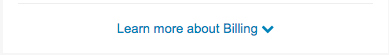
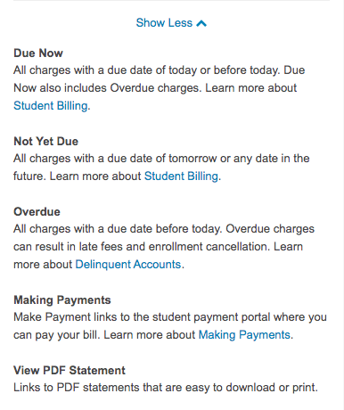

The ShowMore component is used to expand content based on a user's click.

**Unexpanded:**

**Expanded:**

## Props
- clickHandler: Function (required)
- expanded: Boolean (required)
- text: String (required)
- view: Node (required)

#### clickHandler
Function that handles the callback when the user clicks on the ShowMore button. Usually will update a component's state - specifically the boolean that is passed down to `expanded`. 

#### expanded
Boolean that controls whether or not the content within ShowMore is expanded.

#### text
String used to signify the text of the ShowMore button.

#### view
A React component used as the expanded div of the ShowMore component.
